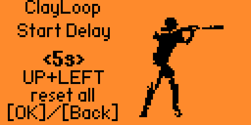
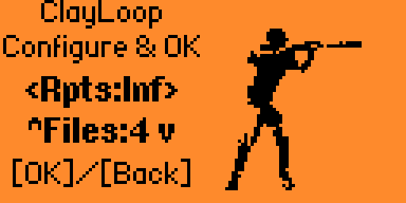
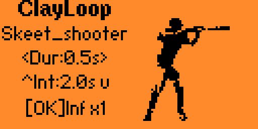

# ClayLoop

**Clay pigeon / skeet shooting controller for Flipper Zero Sub-GHz signals**

Queue up to 4 `.sub` files and transmit them in sequence with configurable delay, duration, interval, and repeat count. Features LED/beep countdown, vibration feedback, mid-countdown cancellation, and persistent per-group file path memory.

## Install (Pre-built FAP)

1. Download [`clayloop.fap`](clayloop.fap) from this repository
2. Copy it to your Flipper Zero SD card at `apps/Sub-GHz/clayloop.fap`
3. The app will appear under **Applications → Sub-GHz** on your Flipper

> Compatible with Flipper Zero official firmware API 87.1 / Target 7.

## Features

- **Multi-file queue** - Select 1-4 `.sub` files, transmitted in order
- **Configurable timing** - Duration (0.5-30s), interval (0-60s), start delay (None, 1-10s)
- **Repeat control** - 1-16 fixed cycles or infinite loop
- **LED countdown** - Red (440Hz) / Yellow (660Hz) / Green (880Hz) flash sequence with vibration before each TX
- **TX feedback** - Purple LED during active transmission, 1000Hz start beep
- **Mid-cancel** - Press OK during any countdown gap to abort immediately
- **Protocol support** - Both RAW and keyed protocol `.sub` files (Princeton, MegaCode, etc.)
- **Persistent settings** - All parameters + per-group file paths saved to SD card
- **Per-group path memory** - File browser remembers paths independently for each file count group (1/2/3/4 files)
- **Reset combo** - Up+Left on delay screen resets all settings and saved paths to defaults
- **13-frame animation** - Animated clay pigeon silhouette on right half of display

## Screens

| Screen | Controls |
|--------|----------|
| **Delay** | Left/Right = start delay, OK = proceed, Back = exit |
| **Setup** | Left/Right = repeats, Up/Down = file count, OK = proceed |
| **Control** | Left/Right = duration, Up/Down = interval, OK = start/stop |

- **Back (short)** returns to previous screen
- **Back (long)** exits the application
- **Up+Left** on delay screen opens reset confirmation

## Build from Source

### Prerequisites

- [ufbt](https://github.com/flipperdevices/flipperzero-ufbt) (micro Flipper Build Tool)
- Flipper Zero with official firmware

### Build

```bash
cd ClayLoop
ufbt
```

Output: `dist/clayloop.fap`

### Install via qFlipper

1. Connect Flipper Zero via USB
2. Open [qFlipper](https://flipperzero.one/update)
3. Navigate to **SD Card > apps/Sub-GHz/**
4. Drag and drop `dist/clayloop.fap`

## Screenshots

| Delay Screen | Setup Screen | Control Screen |
|:---:|:---:|:---:|
|  |  |  |

## File Structure

```
ClayLoop/
├── clayloop.c          # Complete application source
├── clayloop.fap        # Pre-built FAP (ready to install)
├── application.fam     # Flipper app manifest
├── clayloop.png        # App icon (10x10)
├── images/             # Animation frames (13 PNGs)
│   └── frame_0.png ... frame_12.png
├── screenshots/        # qFlipper screenshots
│   ├── control_screen.png
│   ├── delay_screen.png
│   └── setup_screen.png
├── README.md
├── LICENSE
└── .gitignore
```

## Technical Details

- **Target**: Flipper Zero official firmware, API 87.1, Target 7
- **Architecture**: Event-driven with `FuriMessageQueue`, `ViewPort`, `FuriTimer`
- **Radio**: CC1101 internal via `subghz_devices` API (async DMA TX)
- **Storage**: FlipperFormat at `/ext/apps_data/clayloop/config.ff`
- **Display**: 128x64 px - left half UI text, right half 64x64 animation

## License

[MIT](LICENSE) - Copyright (c) 2026 Bobby Gibbs

## Author

Bobby Gibbs ([@bobbygi97169329](https://github.com/bobbygibbs))
